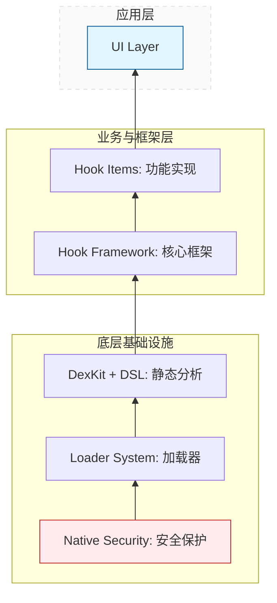

# WeKit 贡献指南

欢迎为 WeKit 项目做出贡献！本指南将帮助你了解项目架构、开发规范和贡献流程。

请在创建 PR 前完整阅读本页内容。

> [!NOTE]
> 本项目的文档、注释及部分非核心代码逻辑由 AI 协作生成。所有内容均经过人工审核与修正。
> [关于 AI 生成内容 (AIGC) 的规范](#关于-ai-生成内容-aigc-的规范)

## 📋 目录

- [项目概述](#项目概述)
- [开发环境设置](#开发环境设置)
- [项目架构](#项目架构)
- [文件夹结构规范](#文件夹结构规范)
- [如何编写新功能](#如何编写新功能)
- [版本兼容性指南](#版本兼容性指南)
- [代码规范](#代码规范)
- [提交规范](#提交规范)
- [测试指南](#测试指南)
- [构建和发布](#构建和发布)
- [文档贡献](#文档贡献)
- [获取帮助](#获取帮助)
- [致谢](#致谢)

---

## 项目概述

**WeKit** 是一个基于 Xposed 框架的微信功能增强模块，采用 GPL-3.0 开源协议。

### 目标与原则

- **学习与研究优先**：项目仅供学习与研究使用，请勿将其用于任何非法用途。

- **隐私与合规**：不上传、不收集个人信息。

- **可维护性**：保持代码清晰、可读、可测试，避免无谓复杂度。

- **GPL-3.0**：所有贡献均将以 GPL-3.0 协议发布。


### 核心信息
- **包名**: `moe.ouom.wekit`
- **目标应用**: 微信 (com.tencent.mm)
- **最低 Android 版本**: Android 10.0+ (API 29)
- **最低微信版本**: 8.0.67
- **Xposed 最低版本**: 51

### 技术栈
- **语言**: Kotlin (主要) + Java + C++
- **UI 框架**: Jetpack Compose + Material Design 3
- **Hook 框架**: Xposed API
- **DEX 分析**: DexKit 2.0.7
- **存储**: MMKV

---

## 开发环境设置

### 必需工具

1. **Android Studio**: Ladybug | 2024.2.1 或更高版本
2. **JDK**: JDK 17
3. **Android SDK**:
   - Compile SDK: 36
   - Build Tools: 最新版本
4. **NDK**: 最新版本 (用于 C++ 编译)
5. **CMake**: 3.22.1 或更高版本

### 克隆项目

```bash
git clone --recursive https://github.com/cwuom/wekit.git 
cd wekit
```

### 导入项目

1. 打开 Android Studio
2. 选择 `File` -> `Open`
3. 选择项目根目录
4. 等待 Gradle 同步完成

### 构建项目

```bash
# Debug 版本
./gradlew assembleDebug
```

---

## 项目架构

WeKit 采用模块化架构，主要分为以下几个层次：

### 架构层次



### 核心组件

#### 1. 加载器系统 (`loader/`)
负责模块的加载和初始化，支持两种 Xposed 实现：
- **Legacy**: 传统 Xposed (API 51+)
- **Modern**: LSPosed (LibXposed API)

**关键类**:
- `ModernHookEntry`: 主入口类
- `UnifiedEntryPoint`: 统一入口点
- `StartupAgent`: 启动代理
- `HybridClassLoader`: 混合类加载器

#### 2. Hook 框架 (`hooks/core/`)
提供 Hook 功能的基础设施：
- **注解驱动**: 使用 `@HookItem` 标记功能
- **自动扫描**: KSP 编译时扫描并生成代码
- **基类体系**: 提供多种基类适配不同场景

**基类**:
- `BaseHookItem`: 所有 Hook 的抽象基类
- `BaseSwitchFunctionHookItem`: 带开关的功能
- `BaseClickableFunctionHookItem`: 可点击触发的功能
- `ApiHookItem`: API 级别的 Hook

#### 3. DEX 分析系统 (`dexkit/`)
使用 DexKit 进行 DEX 文件分析和方法查找：
- **智能缓存**: 基于方法内容 MD5 的缓存机制
- **DSL 语法**: 简化 DEX 查找操作
- **目标管理**: 统一管理查找目标

#### 4. DSL 语法糖 (`core/dsl/`)
提供 Kotlin DSL 简化 Hook 编写：
```kotlin
methodTarget.toDexMethod {
    hook {
        beforeIfEnabled { param ->
            // Hook 逻辑
        }
    }
}
```

#### 5. 配置管理 (`config/`)
使用 MMKV 进行高性能配置存储：
- `ConfigManager`: 配置管理器接口
- `MmkvConfigManagerImpl`: MMKV 实现
- `RuntimeConfig`: 运行时配置

#### 6. UI 系统 (`ui/`)
基于 Jetpack Compose 的现代化 UI：
- **Material Design 3**: 遵循最新设计规范
- **对话框系统**: 统一的设置对话框框架
- **微信设置注入**: 将设置入口注入微信

---

## 文件夹结构规范

由于项目处于快速迭代期，目录结构可能随版本优化而调整。如需获取最新视图，建议直接查阅仓库源码

### 主要目录结构

```
wekit/
├── .github/                   # GitHub 配置
│   ├── workflows/             # CI/CD 工作流
│   └── ISSUE_TEMPLATE/        # Issue 模板
├── app/                       # 主应用模块
│   ├── src/main/
│   │   ├── cpp/               # C++ Native 代码
│   │   │   ├── wekit_lib.cpp  # 主实现
│   │   │   ├── sha256.h       # SHA256 算法
│   │   │   ├── skCrypter.h    # 字符串加密
│   │   │   └── include/       # 头文件
│   │   ├── java/              # Java/Kotlin 源码
│   │   │   └── moe/ouom/wekit/
│   │   │       ├── activity/  # UI 活动
│   │   │       ├── config/    # 配置管理
│   │   │       ├── constants/ # 常量定义
│   │   │       ├── core/      # 核心框架
│   │   │       ├── dexkit/    # DEX 分析
│   │   │       ├── hooks/     # Hook 功能
│   │   │       ├── loader/    # 加载器
│   │   │       ├── security/  # 安全模块
│   │   │       ├── ui/        # UI 组件
│   │   │       ├── util/      # 工具类
│   │   │       └── host/      # 宿主信息
│   │   ├── res/               # Android 资源
│   │   └── resources/         # Xposed 配置
│   ├── build.gradle.kts       # 应用构建配置
│   └── proguard-rules.pro     # 混淆规则
├── build-logic/               # 自定义构建逻辑
│   └── convention/            # 构建约定插件
├── buildSrc/                  # Gradle 构建脚本
│   └── src/main/kotlin/       # 依赖版本管理
├── libs/                      # 子模块库
│   └── common/
│       ├── annotation-scanner/# KSP 注解处理器
│       └── libxposed/         # LibXposed API/Service
├── gradle/                    # Gradle Wrapper
├── build.gradle.kts           # 根项目构建配置
├── settings.gradle.kts        # 项目设置
├── gradle.properties          # Gradle 属性
├── README.md                  # 项目说明
├── CODE_OF_CONDUCT.md         # 行为准则
├── CONTRIBUTING.md            # 贡献指南（本文件）
└── LICENSE                    # GPL-3.0 许可证
```

### 包结构规范

```
moe.ouom.wekit/
├── activity/                  # UI 活动
├── config/                    # 配置管理
│   ├── ConfigManager.java     # 接口
│   ├── *Impl.java             # 实现类
│   └── data/                  # 数据模型
├── constants/                 # 常量定义
│   ├── Constants.kt           # 通用常量
│   ├── MMVersion.kt           # 版本常量
│   └── PackageConstants.java  # 包名常量
├── core/                      # 核心框架
│   ├── bridge/                # 桥接层
│   ├── dsl/                   # DSL 语法
│   └── model/                 # 核心模型
├── dexkit/                    # DEX 分析
│   ├── cache/                 # 缓存管理
│   └── intf/                  # 接口定义
├── hooks/                     # Hook 功能
│   ├── core/                  # Hook 核心
│   │   ├── annotation/        # 注解定义
│   │   └── factory/           # 工厂类
│   ├── item/                  # 具体功能实现
│   │   ├── chat/              # 聊天与消息
│   │   ├── contact/           # 联系人
│   │   ├── moment/            # 朋友圈
│   │   ├── fix/               # 优化与修复
│   │   ├── dev/               # 开发者选项
│   │   ├── fun/               # 娱乐功能
│   │   ├── script/            # 脚本管理
│   │   └── example/           # 示例代码
│   └── sdk/                   # SDK 封装
│       ├── api/               # API 封装
│       └── ui/                # UI 注入
├── loader/                    # 加载器
│   ├── core/                  # 核心加载
│   ├── dyn/                   # 动态加载
│   ├── hookapi/               # Hook API 接口
│   ├── hookimpl/              # Hook 实现
│   ├── legacy/                # 旧版支持
│   ├── modern/                # 现代支持
│   └── startup/               # 启动流程
├── security/                  # 安全模块
├── ui/                        # UI 组件
│   ├── creator/               # UI 创建器
│   │   └── dialog/            # 对话框
│   │       ├── item/          # 功能配置对话框（包结构镜像 hooks.item）
│   │       │   ├── chat/      # 聊天相关配置
│   │       │   ├── contact/   # 联系人相关配置
│   │       │   └── ...        # 其他分类
│   │       └── BaseRikkaDialog.kt  # 对话框基类
│   ├── theme/                 # 主题
│   └── widget/                # 自定义控件
├── util/                      # 工具类
│   ├── common/                # 通用工具
│   ├── hookstatus/            # Hook 状态
│   ├── io/                    # IO 工具
│   └── log/                   # 日志工具
└── host/                      # 宿主信息
```

### 命名规范

#### 包命名
- **核心框架**: `moe.ouom.wekit.core.*`
- **Hook 功能**: `moe.ouom.wekit.hooks.item.*`
- **配置对话框**: `moe.ouom.wekit.ui.creator.dialog.item.*` （**必须镜像 Hook 功能的包结构**）
- **加载器**: `moe.ouom.wekit.loader.*`
- **工具类**: `moe.ouom.wekit.util.*`

> **📌 重要规范**：配置对话框的包结构必须与对应的 Hook 项保持一致
> - Hook: `hooks.item.chat.risk.WeRedPacketAuto`
> - Dialog: `ui.creator.dialog.item.chat.risk.WeRedPacketConfigDialog`

#### 类命名
- **基类**: `Base*` (如 `BaseHookItem`)
- **接口**: `I*` (如 `IDexFind`, `IHookBridge`)
- **工厂**: `*Factory` (如 `HookItemFactory`)
- **管理器**: `*Manager` (如 `ConfigManager`)
- **工具类**: `*Utils` (如 `LogUtils`)
- **实现类**: `*Impl` (如 `MmkvConfigManagerImpl`)

#### 文件命名
- **普通类**: 正常命名 (如 `HookItemFactory.java`) - 会被加密保护
- **公开类**: 下划线前缀 (如 `_ExceptionFactory.java`) - 不会被加密，供外部访问
- **Kotlin 文件**: 使用 PascalCase (如 `DslExtensions.kt`)

> **重要说明**:
> - 在 `hooks` 包下，以下划线 `_` 开头的类文件会被加入白名单，不会被加密到 Hidden DEX 中
> - 这些类通常是需要被其他模块或外部访问的公开 API
> - 普通命名的类会在构建时被加密保护，防止被轻易分析

---

## 如何编写新功能

### 功能开发流程

```
1. 需求分析
   ├─ 确定功能目标
   ├─ 分析技术可行性
   └─ 确定功能分类

2. DEX 分析
   ├─ 使用 DexKit 查找目标方法
   ├─ 分析方法签名和调用关系
   └─ 确定 Hook 点

3. 编写代码
   ├─ 创建 Hook 类
   ├─ 实现 DEX 查找逻辑
   ├─ 实现 Hook 逻辑
   ├─ 添加配置和 UI
   └─ ⚠️ 实现版本兼容性逻辑（使用 MMVersion）

4. 测试验证
   ├─ 本地测试
   ├─ ⚠️ 多版本兼容性测试（必须测试多个微信版本）
   ├─ 性能测试
   └─ ⚠️ 确认不破坏原有功能

5. 提交代码
   ├─ 遵循提交规范
   ├─ 编写文档
   └─ 创建 Pull Request
```

---

## 版本兼容性指南

### ⚠️ 核心原则

**在开发任何新功能或修改现有功能时,必须遵循以下原则:**

1. **不破坏原有功能**: 任何更改都不能导致现有功能失效
2. **不放弃旧版本适配**: 必须保持对旧版本微信的兼容性
3. **使用版本分支**: 通过 `MMVersion` 和 `requireMinWeChatVersion` 为不同版本提供不同的实现

### MMVersion 使用指南

`MMVersion` 是 WeKit 提供的微信版本常量类,位于 `moe.ouom.wekit.constants.MMVersion`。

#### 可用的版本常量

```kotlin
object MMVersion {
    const val MM_8_0_67 = 3000
    const val MM_8_0_66 = 2980
    const val MM_8_0_65 = 2960
    const val MM_8_0_64 = 2940
    const val MM_8_0_63 = 2920
    const val MM_8_0_62 = 2900
    const val MM_8_0_61 = 2880
    const val MM_8_0_60 = 2860
    const val MM_8_0_58 = 2840
    const val MM_8_0_57 = 2820
    const val MM_8_0_56 = 2780
    const val MM_8_0_49 = 2600
    // ... 更多版本常量
}
```

#### 获取当前微信版本

```kotlin
import moe.ouom.wekit.host.HostInfo

// 获取当前微信版本号
val currentVersion = HostInfo.getVersionCode()
```

### 版本适配示例

#### 示例 1: 基本版本判断

```kotlin
import moe.ouom.wekit.constants.MMVersion
import moe.ouom.wekit.host.HostInfo

override fun entry(classLoader: ClassLoader) {
    val currentVersion = HostInfo.getVersionCode()

    // 根据版本选择不同的实现
    when {
        currentVersion >= MMVersion.MM_8_0_90 -> {
            // 8.0.90 及以上版本的实现
            hookForNewVersion(classLoader)
        }
        currentVersion >= MMVersion.MM_8_0_70 -> {
            // 8.0.70 ~ 8.0.89 版本的实现
            hookForMidVersion(classLoader)
        }
        else -> {
            // 8.0.70 以下版本的实现
            hookForOldVersion(classLoader)
        }
    }
}
```

#### 示例 2: DEX 查找的版本适配

```kotlin
override fun dexFind(dexKit: DexKitBridge): Map<String, String> {
    val descriptors = mutableMapOf<String, String>()
    val currentVersion = HostInfo.getVersionCode()

    if (currentVersion >= MMVersion.MM_8_0_90) {
        // 新版本的查找逻辑
        methodTarget.find(dexKit, descriptors = descriptors) {
            matcher {
                usingEqStrings("newVersionString")
            }
        }
    } else {
        // 旧版本的查找逻辑
        methodTarget.find(dexKit, descriptors = descriptors) {
            matcher {
                usingEqStrings("oldVersionString")
            }
        }
    }

    return descriptors
}
```

#### 示例 3: Hook 逻辑的版本适配

```kotlin
override fun entry(classLoader: ClassLoader) {
    val currentVersion = HostInfo.getVersionCode()

    methodTarget.toDexMethod {
        hook {
            beforeIfEnabled { param ->
                if (currentVersion >= MMVersion.MM_8_0_90) {
                    // 新版本的 Hook 逻辑
                    val newParam = param.args[0] as? String
                    WeLogger.d("NewVersion", "Processing: $newParam")
                    // 新版本的处理...
                } else {
                    // 旧版本的 Hook 逻辑
                    val oldParam = param.args[1] as? String
                    WeLogger.d("OldVersion", "Processing: $oldParam")
                    // 旧版本的处理...
                }
            }
        }
    }
}
```

#### 示例 4: 完整的版本兼容实现

```kotlin
package moe.ouom.wekit.hooks.item.chat.msg

import moe.ouom.wekit.constants.MMVersion
import moe.ouom.wekit.core.model.BaseSwitchFunctionHookItem
import moe.ouom.wekit.dexkit.intf.IDexFind
import moe.ouom.wekit.hooks.core.annotation.HookItem
import moe.ouom.wekit.host.HostInfo
import org.luckypray.dexkit.DexKitBridge

@HookItem(
    path = "聊天与消息/版本兼容示例",
    desc = "展示如何进行版本适配"
)
class VersionCompatExample : BaseSwitchFunctionHookItem(), IDexFind {

    private val methodTarget by dexMethod()

    override fun dexFind(dexKit: DexKitBridge): Map<String, String> {
        val descriptors = mutableMapOf<String, String>()
        val currentVersion = HostInfo.getVersionCode()

        // 根据版本使用不同的查找策略
        methodTarget.find(dexKit, descriptors = descriptors) {
            matcher {
                when {
                    currentVersion >= MMVersion.MM_8_0_90 -> {
                        // 8.0.90+ 版本的特征
                        usingEqStrings("newFeatureString")
                        paramCount = 3
                    }
                    currentVersion >= MMVersion.MM_8_0_70 -> {
                        // 8.0.70 ~ 8.0.89 版本的特征
                        usingEqStrings("midFeatureString")
                        paramCount = 2
                    }
                    else -> {
                        // 8.0.70 以下版本的特征
                        usingEqStrings("oldFeatureString")
                        paramCount = 1
                    }
                }
            }
        }

        return descriptors
    }

    override fun entry(classLoader: ClassLoader) {
        val currentVersion = HostInfo.getVersionCode()

        methodTarget.toDexMethod {
            hook {
                beforeIfEnabled { param ->
                    try {
                        when {
                            currentVersion >= MMVersion.MM_8_0_90 -> {
                                handleNewVersion(param)
                            }
                            currentVersion >= MMVersion.MM_8_0_70 -> {
                                handleMidVersion(param)
                            }
                            else -> {
                                handleOldVersion(param)
                            }
                        }
                    } catch (e: Throwable) {
                        WeLogger.e("VersionCompatExample", "Hook 失败", e)
                    }
                }
            }
        }
    }

    private fun handleNewVersion(param: XC_MethodHook.MethodHookParam) {
        // 新版本的处理逻辑
        val arg1 = param.args[0]
        val arg2 = param.args[1]
        val arg3 = param.args[2]
        WeLogger.d("VersionCompatExample", "处理新版本: $arg1, $arg2, $arg3")
        // ... 具体实现
    }

    private fun handleMidVersion(param: XC_MethodHook.MethodHookParam) {
        // 中间版本的处理逻辑
        val arg1 = param.args[0]
        val arg2 = param.args[1]
        WeLogger.d("VersionCompatExample", "处理中间版本: $arg1, $arg2")
        // ... 具体实现
    }

    private fun handleOldVersion(param: XC_MethodHook.MethodHookParam) {
        // 旧版本的处理逻辑
        val arg1 = param.args[0]
        WeLogger.d("VersionCompatExample", "处理旧版本: $arg1")
        // ... 具体实现
    }
}
```

### 版本兼容性最佳实践

#### 1. 优先使用版本分支而非功能禁用

**❌ 不推荐**:
```kotlin
// 直接禁用旧版本的功能
if (currentVersion < MMVersion.MM_8_0_90) {
    WeLogger.w("此功能不支持旧版本")
    return
}
```

**✅ 推荐**:
```kotlin
// 为旧版本提供替代实现
if (currentVersion >= MMVersion.MM_8_0_90) {
    hookNewVersionMethod()
} else {
    hookOldVersionMethod()  // 提供旧版本的实现
}
```

#### 2. 使用 try-catch 保护版本特定代码

```kotlin
override fun entry(classLoader: ClassLoader) {
    try {
        if (currentVersion >= MMVersion.MM_8_0_90) {
            // 新版本特定的代码
            hookNewFeature()
        } else {
            // 旧版本的代码
            hookOldFeature()
        }
    } catch (e: Throwable) {
        WeLogger.e("MyHook", "版本适配失败: ${HostInfo.getVersionName()}", e)
        // 不要让异常影响其他功能
    }
}
```


#### 3. 文档化版本要求

在代码注释中明确说明版本要求:

```kotlin
/**
 * 消息防撤回功能
 *
 * 版本兼容性:
 * - 8.0.90+: 使用新的消息撤回 API
 * - 8.0.70 ~ 8.0.89: 使用旧的消息撤回 API
 * - 8.0.65 ~ 8.0.69: 使用最早的消息撤回 API
 *
 * @author Your Name
 * @since 1.0.0
 */
@HookItem(
    path = "聊天与消息/防撤回",
    desc = "阻止消息撤回"
)
class AntiRevokeMsg : BaseSwitchFunctionHookItem() {
    // ...
}
```

### 常见版本兼容问题

#### 问题 1: 方法签名变化

**问题**: 不同版本的微信,同一个方法的参数数量或类型可能不同

**解决方案**:
```kotlin
override fun dexFind(dexKit: DexKitBridge): Map<String, String> {
    val descriptors = mutableMapOf<String, String>()
    val currentVersion = HostInfo.getVersionCode()

    methodTarget.find(dexKit, descriptors = descriptors) {
        matcher {
            usingEqStrings("commonString")  // 使用共同的特征

            // 根据版本设置不同的参数数量
            paramCount = if (currentVersion >= MMVersion.MM_8_0_90) 3 else 2
        }
    }

    return descriptors
}
```

#### 问题 2: 类名或包名变化

**问题**: 微信重构导致类的位置变化

**解决方案**:
```kotlin
override fun entry(classLoader: ClassLoader) {
    val currentVersion = HostInfo.getVersionCode()

    val targetClass = if (currentVersion >= MMVersion.MM_8_0_90) {
        "com.tencent.mm.new.package.ClassName"
    } else {
        "com.tencent.mm.old.package.ClassName"
    }

    XposedHelpers.findAndHookMethod(
        targetClass,
        classLoader,
        "methodName",
        // ...
    )
}
```

### 版本兼容性检查清单

在提交代码前,请确认:

- [ ] 已使用 `MMVersion` 进行版本判断
- [ ] 已为不同版本提供不同的实现分支
- [ ] 已在多个微信版本上测试
- [ ] 已确认不会破坏旧版本的功能
- [ ] 已添加版本相关的日志输出
- [ ] 已在代码注释中说明版本兼容性
- [ ] 已使用 try-catch 保护版本特定代码
- [ ] 如果功能不支持旧版本,已使用 `requireMinWeChatVersion`

---

### 标准 Hook 功能编写示例

#### 示例 1: 带开关的简单功能

```kotlin
package moe.ouom.wekit.hooks.item.chat.msg

import de.robv.android.xposed.XC_MethodHook
import moe.ouom.wekit.core.model.BaseSwitchFunctionHookItem
import moe.ouom.wekit.dexkit.intf.IDexFind
import moe.ouom.wekit.hooks.core.annotation.HookItem
import org.luckypray.dexkit.DexKitBridge

/**
 * 阻止消息撤回功能
 *
 * @author Your Name
 * @since 1.0.0
 */
@HookItem(
    path = "聊天与消息/阻止消息撤回",  // 功能在设置中的路径
    desc = "防止对方撤回消息"          // 功能描述
)
class AntiRevokeMsg : BaseSwitchFunctionHookItem(), IDexFind {

    // 1. 声明需要 Hook 的方法（使用委托）
    private val methodRevokeMsg by dexMethod()

    // 2. 实现 DEX 查找逻辑
    override fun dexFind(dexKit: DexKitBridge): Map<String, String> {
        val descriptors = mutableMapOf<String, String>()

        // 使用 DexKit 查找目标方法
        methodRevokeMsg.find(dexKit, descriptors = descriptors) {
            matcher {
                // 通过特征字符串查找
                usingEqStrings("doRevokeMsg xmlSrvMsgId=%d talker=%s isGet=%s")
            }
        }

        return descriptors
    }

    // 3. 实现 Hook 逻辑
    override fun entry(classLoader: ClassLoader) {
        methodRevokeMsg.toDexMethod {
            hook {
                // beforeIfEnabled: 仅在功能开启时执行
                beforeIfEnabled { param ->
                    // 阻止方法执行
                    param.resultNull()

                    // 记录日志
                    WeLogger.d("AntiRevokeMsg", "已阻止消息撤回")
                }
            }
        }
    }
}
```

#### 示例 2: 带确认对话框的开关功能

`BaseSwitchFunctionHookItem` 支持通过重写 `onBeforeToggle(boolean newState)` 方法来在开关切换前进行确认。如果返回 `false`,开关状态会被撤回。

```kotlin
package moe.ouom.wekit.hooks.item.chat.risk

import android.content.Context
import com.afollestad.materialdialogs.MaterialDialog
import moe.ouom.wekit.core.model.BaseSwitchFunctionHookItem
import moe.ouom.wekit.dexkit.intf.IDexFind
import moe.ouom.wekit.hooks.core.annotation.HookItem
import org.luckypray.dexkit.DexKitBridge

/**
 * 带确认对话框的危险功能
 *
 * @author Your Name
 * @since 1.0.0
 */
@HookItem(
    path = "聊天与消息/危险功能",
    desc = "启用前需要确认"
)
class DangerousFeature : BaseSwitchFunctionHookItem(), IDexFind {

    private val methodTarget by dexMethod()

    override fun dexFind(dexKit: DexKitBridge): Map<String, String> {
        val descriptors = mutableMapOf<String, String>()
        // ... DEX 查找逻辑
        return descriptors
    }

    override fun entry(classLoader: ClassLoader) {
        methodTarget.toDexMethod {
            hook {
                beforeIfEnabled { param ->
                    // Hook 逻辑
                }
            }
        }
    }

    /**
     * 在开关状态切换前调用,用于确认是否允许切换
     *
     * @param newState 即将切换到的新状态 (true: 启用, false: 禁用)
     * @param context 上下文对象,可用于显示对话框等UI操作
     * @return true: 允许切换, false: 取消切换
     */
    override fun onBeforeToggle(newState: Boolean, context: Context): Boolean {
        if (newState) {
            // 启用功能前显示警告对话框
            MaterialDialog(context)
                .title(text = "警告")
                .message(text = "此功能可能导致账号异常,确定要启用吗?")
                .positiveButton(text = "确定") { dialog ->
                    // 用户确认后,调用 applyToggle 完成切换
                    // 此方法会自动: 保存配置 + 更新状态 + 更新UI
                    applyToggle(true)
                }
                .negativeButton(text = "取消") { dialog ->
                    dialog.dismiss()
                }
                .show()

            // 返回 false 阻止自动切换
            return false
        }

        // 禁用功能时直接允许
        return true
    }
}
```

**⚠️ 为什么异步对话框需要手动设置状态？**

<details>
<summary>点击展开详细解释</summary>

**核心问题**：`onBeforeToggle()` 是**同步方法**，必须立即返回 `true` 或 `false`，但对话框是**异步的**，用户点击按钮是在未来某个时刻。

**错误做法(直接返回 true)**:
```kotlin
override fun onBeforeToggle(newState: Boolean, context: Context): Boolean {
    if (newState) {
        MaterialDialog(context)
            .message(text = "确定要启用吗?")
            .positiveButton(text = "确定") { dialog ->
                // 这里的代码会在用户点击后才执行
            }
            .show()

        return true  // ❌ 错误！这会立即切换开关，对话框还没显示完
    }
    return true
}
```

**执行时序**：
```
1. 用户点击开关
2. 调用 onBeforeToggle(true)
3. 显示对话框（异步，立即返回）
4. onBeforeToggle 返回 true
5. 开关立即切换为开启状态 ← 问题：用户还没确认！
6. （稍后）用户点击"确定"或"取消" ← 太晚了，开关已经开了
```

**正确做法(返回 false + 手动设置)**:
```kotlin
override fun onBeforeToggle(newState: Boolean, context: Context): Boolean {
    if (newState) {
        MaterialDialog(context)
            .message(text = "确定要启用吗?")
            .positiveButton(text = "确定") { dialog ->
                // 用户确认后,调用 applyToggle 完成切换
                applyToggle(true)
            }
            .show()

        return false  // ✅ 正确！阻止自动切换，等待用户确认
    }
    return true
}
```

**执行时序**:
```
1. 用户点击开关
2. 调用 onBeforeToggle(true)
3. 显示对话框(异步,立即返回)
4. onBeforeToggle 返回 false
5. 开关状态被撤回,保持关闭 ← 正确:等待用户确认
6. (稍后)用户点击"确定"
7. 执行 applyToggle(true) ← 自动完成: 保存配置 + 更新状态 + 更新UI
```

**总结**:
- **同步确认**(如权限检查):直接返回 `true` 或 `false`
- **异步确认**(如对话框):返回 `false` + 在回调中调用 `applyToggle(newState)`
- **applyToggle() 方法**:一键完成所有操作(保存配置 + 更新状态 + 更新UI)

</details>

**更简单的同步确认示例**:

```kotlin
/**
 * 简单的权限检查示例
 */
override fun onBeforeToggle(newState: Boolean, context: Context): Boolean {
    if (newState) {
        // 检查前置条件
        if (!checkPermission()) {
            showToast("缺少必要权限,无法启用此功能")
            return false  // 阻止切换
        }

        // 检查微信版本
        if (!checkWeChatVersion()) {
            showToast("当前微信版本不支持此功能")
            return false  // 阻止切换
        }
    }

    return true  // 允许切换
}
```

**使用场景**:
- 启用危险功能前显示警告对话框
- 检查权限或前置条件
- 验证微信版本兼容性
- 在禁用功能前进行确认
- 记录用户操作日志

**注意事项**:
- 返回 `true` 允许切换,返回 `false` 取消切换并撤回开关状态
- 方法签名:`onBeforeToggle(newState: Boolean, context: Context): Boolean`,第二个参数提供上下文对象
- **异步确认**:返回 `false` 阻止自动切换,在确认后调用 `applyToggle(newState)` 完成切换
- **applyToggle() 方法**:自动完成保存配置 + 更新状态 + 更新UI,无需手动操作
- 默认实现返回 `true`,即允许所有切换操作
- 此方法在点击开关按钮或点击整个条目时都会被调用
- `BaseSwitchFunctionHookItem` 和 `BaseClickableFunctionHookItem` 都支持此方法

#### 示例 2: 带配置界面的复杂功能

> **📁 重要：配置对话框的包结构规范**
>
> 配置对话框必须放在 `moe.ouom.wekit.ui.creator.dialog.item` 包下，并且**包结构要与 Hook 项保持一致**。
>
> **规则**：
> - Hook 项在：`moe.ouom.wekit.hooks.item.{分类}`
> - 对话框在：`moe.ouom.wekit.ui.creator.dialog.item.{分类}`
>
> **示例**：
> - Hook 项：`moe.ouom.wekit.hooks.item.chat.risk.WeRedPacketAuto`
> - 对话框：`moe.ouom.wekit.ui.creator.dialog.item.chat.risk.WeRedPacketConfigDialog`
>
> **命名建议**：对话框类名建议使用 `{功能名}ConfigDialog` 格式

**步骤 1: 创建配置对话框**

```kotlin
package moe.ouom.wekit.ui.creator.dialog.item.chat.risk

import android.content.Context
import android.text.InputType
import moe.ouom.wekit.ui.creator.dialog.BaseRikkaDialog

class AutoGrabRedPacketConfigDialog(context: Context) : BaseRikkaDialog(context, "自动抢红包") {

    override fun initPreferences() {
        addCategory("通用设置")

        addSwitchPreference(
            key = "red_packet_notification",
            title = "抢到后通知",
            summary = "在通知栏显示抢到的金额"
        )

        addCategory("高级选项")

        addSwitchPreference(
            key = "red_packet_self",
            title = "抢自己的红包",
            summary = "默认情况下不抢自己发出的"
        )

        addSwitchPreference(
            key = "red_packet_delay_random",
            title = "随机延时",
            summary = "模拟人工操作（500ms ~ 3000ms），防止风控"
        )

        val customDelayView = addEditTextPreference(
            key = "red_packet_delay_custom",
            title = "自定义延迟",
            summary = "延迟时间",
            defaultValue = "1000",
            hint = "请输入延迟时间（毫秒）",
            inputType = InputType.TYPE_CLASS_NUMBER,
            maxLength = 5,
            summaryFormatter = { value ->
                if (value.isEmpty()) "0 ms" else "$value ms"
            }
        )

        // 当随机延迟开启时，禁用自定义延迟
        setDependency(
            dependentView = customDelayView,
            dependencyKey = "red_packet_delay_random",
            enableWhen = false,
            hideWhenDisabled = false
        )
    }
}
```

**步骤 2: 实现 Hook 功能**

```kotlin
package moe.ouom.wekit.hooks.item.chat.risk

import android.content.Context
import moe.ouom.wekit.config.WeConfig
import moe.ouom.wekit.core.model.BaseClickableFunctionHookItem
import moe.ouom.wekit.dexkit.intf.IDexFind
import moe.ouom.wekit.hooks.core.annotation.HookItem
import moe.ouom.wekit.ui.creator.dialog.item.chat.risk.AutoGrabRedPacketConfigDialog
import org.luckypray.dexkit.DexKitBridge
import kotlin.random.Random

/**
 * 自动抢红包功能
 *
 * @author Your Name
 * @since 1.0.0
 */
@HookItem(
    path = "聊天与消息/自动抢红包",
    desc = "监听消息并自动拆开红包（点击配置）"
)
class AutoGrabRedPacket : BaseClickableFunctionHookItem(), IDexFind {

    // 声明需要 Hook 的方法
    private val methodReceiveRedPacket by dexMethod()

    override fun dexFind(dexKit: DexKitBridge): Map<String, String> {
        val descriptors = mutableMapOf<String, String>()

        // 查找接收红包的方法
        methodReceiveRedPacket.find(dexKit, descriptors = descriptors) {
            matcher {
                usingEqStrings("receiveRedPacket")
            }
        }

        return descriptors
    }

    override fun entry(classLoader: ClassLoader) {
        // Hook 接收红包方法
        methodReceiveRedPacket.toDexMethod {
            hook {
                afterIfEnabled { param ->
                    // 读取配置
                    val config = ConfigManager.getDefaultConfig()
                    val grabSelf = config.getBoolPrek("red_packet_self")
                    val randomDelay = config.getBoolPrek("red_packet_delay_random")
                    val customDelay = config.getStringPrek("red_packet_delay_custom", "0")
                        .toLongOrNull() ?: 0L

                    // 获取红包信息
                    val redPacketId = param.args[0] as? String ?: return@afterIfEnabled
                    val isSelf = checkIsSelf(param.args[1])

                    // 判断是否需要抢
                    if (isSelf && !grabSelf) {
                        WeLogger.d("AutoGrabRedPacket", "跳过自己的红包: $redPacketId")
                        return@afterIfEnabled
                    }

                    // 计算延迟时间
                    val delayTime = if (randomDelay) {
                        Random.nextLong(500, 3000)
                    } else {
                        customDelay
                    }

                    // 延迟抢红包
                    Thread {
                        try {
                            if (delayTime > 0) Thread.sleep(delayTime)
                            openRedPacket(redPacketId)
                            WeLogger.d("AutoGrabRedPacket", "已抢红包: $redPacketId")
                        } catch (e: Throwable) {
                            WeLogger.e("AutoGrabRedPacket", "抢红包失败", e)
                        }
                    }.start()
                }
            }
        }
    }

    /**
     * 重写 onClick 方法，点击时打开配置对话框
     */
    override fun onClick(context: Context?) {
        context?.let { AutoGrabRedPacketConfigDialog(it).show() }
    }

    private fun checkIsSelf(contact: Any?): Boolean {
        // 实现判断是否为自己的逻辑
        return false
    }

    private fun openRedPacket(redPacketId: String) {
        // 实现打开红包的逻辑
    }
}
```

**关键点说明**:
1. 使用 `BaseClickableFunctionHookItem` 而不是 `BaseSwitchFunctionHookItem`
2. 创建继承自 `BaseRikkaDialog` 的配置对话框
3. 重写 `onClick(Context context)` 方法打开配置界面
4. 在 Hook 中使用 `config.getBoolPrek()` / `getStringPrek()` 读取配置
5. 配置对话框支持开关、文本输入、依赖关系等

#### 示例 3: 可点击触发的功能

```kotlin
package moe.ouom.wekit.hooks.item.dev

import moe.ouom.wekit.core.model.BaseClickableFunctionHookItem
import moe.ouom.wekit.dexkit.cache.DexCacheManager
import moe.ouom.wekit.hooks.core.annotation.HookItem

/**
 * DEX 缓存清理器
 *
 * @author Your Name
 * @since 1.0.0
 */
@HookItem(
    path = "开发者选项/清理 DEX 缓存",
    desc = "清理 DexKit 缓存数据"
)
class DexCacheCleaner : BaseClickableFunctionHookItem() {

    // 如果重写noSwitchWidget为true时将永远不会调用entry 此时可不重写entry方法来触发功能 通过onClick触发
    /*
    override fun entry(classLoader: ClassLoader) {
        // 可点击功能不需要 Hook，只需实现 onClick
    }
    */

    override fun onClick() {
        // 清理缓存
        DexCacheManager.clearCache()

        // 显示提示
        showToast("DEX 缓存已清理")

        WeLogger.i("DexCacheCleaner", "DEX 缓存已清理")
    }

    override fun noSwitchWidget(): Boolean = true
}
```

### BaseRikkaDialog 配置对话框详细指南

`BaseRikkaDialog` 是 WeKit 提供的配置对话框基类,采用 DSL 风格的 API 设计,支持多种配置项类型和依赖关系管理。

#### 基本使用流程

1. 创建继承自 `BaseRikkaDialog` 的类
2. 重写 `initPreferences()` 方法
3. 在 `initPreferences()` 中使用 `addXXX` 方法添加配置项
4. 在 Hook 类的 `onClick(Context)` 方法中创建并显示对话框

#### API 方法详解

##### 1. addCategory(title: String)

添加一个设置分类标题,用于将配置项分组显示。

**参数**:
- `title`: 分类标题文本

**示例**:
```kotlin
override fun initPreferences() {
    addCategory("通用设置")
    // ... 添加通用设置相关的配置项

    addCategory("高级选项")
    // ... 添加高级选项相关的配置项
}
```

##### 2. addSwitchPreference(...)

添加一个开关选项,用于布尔值配置。

**完整签名**:
```kotlin
protected fun addSwitchPreference(
    key: String,              // 配置存储的 Key
    title: String,            // 选项显示的标题
    summary: String,          // 选项显示的摘要/说明
    iconName: String? = null, // 图标资源名称(可选)
    useFullKey: Boolean = false // 是否使用完整 Key
): View // 返回该选项的根 View
```

**参数说明**:
- `key`: 配置存储的 Key。如果 `useFullKey = false`,会自动拼接 `Constants.PrekXXX` 前缀
- `title`: 选项标题,显示在开关左侧
- `summary`: 选项说明,显示在标题下方
- `iconName`: 图标资源名称,如 `"ic_notification"`,可选
- `useFullKey`:
  - `false`(默认): 自动拼接前缀,实际 Key 为 `"prek_xxx_{key}"`
  - `true`: 直接使用传入的 key

**返回值**: 返回该选项的根 View,用于后续建立依赖关系

**示例**:
```kotlin
addSwitchPreference(
    key = "red_packet_notification",
    title = "抢到后通知",
    summary = "在通知栏显示抢到的金额"
)

// 带图标的开关
addSwitchPreference(
    key = "enable_feature",
    title = "启用功能",
    summary = "开启此功能后生效",
    iconName = "ic_check_circle"
)
```

##### 3. addEditTextPreference(...)

添加一个文本输入选项,点击后弹出输入对话框。

**完整签名**:
```kotlin
protected fun addEditTextPreference(
    key: String,
    title: String,
    summary: String,
    defaultValue: String = "",
    hint: String? = null,
    inputType: Int = InputType.TYPE_CLASS_TEXT,
    maxLength: Int = 0,
    singleLine: Boolean = true,
    iconName: String? = null,
    useFullKey: Boolean = false,
    summaryFormatter: ((String) -> String)? = null
): View
```

**参数说明**:
- `key`: 配置存储的 Key
- `title`: 选项标题
- `summary`: 选项摘要
- `defaultValue`: 默认值(如果未设置过)
- `hint`: 输入框内的提示文本,可选
- `inputType`: 输入类型,如:
  - `InputType.TYPE_CLASS_TEXT`: 普通文本
  - `InputType.TYPE_CLASS_NUMBER`: 数字
  - `InputType.TYPE_TEXT_VARIATION_PASSWORD`: 密码
- `maxLength`: 最大输入长度,0 表示不限制
- `singleLine`: 是否强制单行输入
- `iconName`: 图标资源名称,可选
- `useFullKey`: 是否使用完整 Key
- `summaryFormatter`: 自定义摘要格式化函数
  - 参数: 当前值(String)
  - 返回: 显示的文本(String)
  - 如果为 `null`,使用默认格式: `"$summary: $value"`

**返回值**: 返回该选项的根 View

**示例**:
```kotlin
// 基本文本输入
addEditTextPreference(
    key = "user_name",
    title = "用户名",
    summary = "设置显示名称",
    defaultValue = "匿名用户",
    hint = "请输入用户名"
)

// 数字输入
addEditTextPreference(
    key = "red_packet_delay_custom",
    title = "自定义延迟",
    summary = "延迟时间",
    defaultValue = "1000",
    hint = "请输入延迟时间(毫秒)",
    inputType = InputType.TYPE_CLASS_NUMBER,
    maxLength = 5,
    summaryFormatter = { value ->
        if (value.isEmpty()) "0 ms" else "$value ms"
    }
)

// 多行文本输入
addEditTextPreference(
    key = "custom_message",
    title = "自定义消息",
    summary = "输入自定义文本",
    hint = "支持多行输入",
    singleLine = false,
    maxLength = 500
)
```

##### 4. addSelectPreference(...)

添加一个下拉选择选项,点击后弹出选择菜单。

**完整签名**:
```kotlin
protected fun addSelectPreference(
    key: String,
    title: String,
    summary: String,
    options: Map<Int, String>,
    defaultValue: Int,
    iconName: String? = null,
    useFullKey: Boolean = false
): View
```

**参数说明**:
- `key`: 配置存储的 Key
- `title`: 选项标题
- `summary`: 选项摘要
- `options`: 选项映射表,格式为 `Int 值 -> 显示文本`
- `defaultValue`: 默认选中的 Int 值
- `iconName`: 图标资源名称,可选
- `useFullKey`: 是否使用完整 Key

**返回值**: 返回该选项的根 View

**示例**:
```kotlin
addSelectPreference(
    key = "message_mode",
    title = "消息模式",
    summary = "选择消息处理方式",
    options = mapOf(
        0 to "普通模式",
        1 to "静音模式",
        2 to "免打扰模式"
    ),
    defaultValue = 0
)

// 带图标的选择器
addSelectPreference(
    key = "theme_mode",
    title = "主题模式",
    summary = "选择界面主题",
    options = mapOf(
        1 to "跟随系统",
        2 to "浅色主题",
        3 to "深色主题"
    ),
    defaultValue = 1,
    iconName = "ic_palette"
)
```

##### 5. addPreference(...)

添加一个普通点击项,用于打开二级菜单、显示信息、链接跳转等。

**完整签名**:
```kotlin
protected fun addPreference(
    title: String,
    summary: String? = null,
    iconName: String? = null,
    onClick: ((View, TextView?) -> Unit)? = null
): TextView? // 返回 Summary TextView
```

**参数说明**:
- `title`: 选项标题
- `summary`: 选项摘要,可选
  - `null`: 不显示摘要区域(GONE)
  - `""`: 显示空摘要区域(VISIBLE)
  - 其他: 显示指定文本
- `iconName`: 图标资源名称,可选
- `onClick`: 点击回调,可选
  - 参数1: 点击的条目 View
  - 参数2: 摘要 TextView(可用于动态更新文本)
  - 如果为 `null`,该项不可点击

**返回值**: 返回 Summary TextView,用于后续动态更新文本

**示例**:
```kotlin
// 基本点击项
addPreference(
    title = "关于",
    summary = "WeKit v1.0.0",
    onClick = { _, _ ->
        // 显示关于对话框
        showAboutDialog()
    }
)

// 不可点击的信息项
addPreference(
    title = "版本信息",
    summary = "当前版本: 1.0.0"
    // 不提供 onClick,该项不可点击
)

// 动态更新摘要
val summaryView = addPreference(
    title = "检查更新",
    summary = "点击检查最新版本",
    onClick = { _, summary ->
        // 检查更新
        checkUpdate { version ->
            summary?.text = "最新版本: $version"
        }
    }
)
```

##### 6. setDependency(...)

设置依赖关系,当依赖项的状态改变时,控制目标 View 的启用/禁用或显示/隐藏状态。

**完整签名**:
```kotlin
protected fun setDependency(
    dependentView: View,
    dependencyKey: String,
    enableWhen: Boolean = true,
    hideWhenDisabled: Boolean = false,
    useFullKey: Boolean = false
)
```

**参数说明**:
- `dependentView`: 受控制的 View(通常是 `addXXXPreference` 返回的 View)
- `dependencyKey`: 依赖项的配置 Key(通常是 Switch 的 key)
- `enableWhen`: 依赖项为何值时启用目标 View
  - `true`(默认): 依赖项为 `true` 时启用,`false` 时禁用
  - `false`: 依赖项为 `false` 时启用,`true` 时禁用
- `hideWhenDisabled`: 禁用时是否隐藏
  - `false`(默认): 禁用时只是变灰(disabled),仍然可见
  - `true`: 禁用时完全隐藏(GONE)
- `useFullKey`: `dependencyKey` 是否为完整 Key

**示例**:
```kotlin
// 基本依赖:当"随机延迟"开启时,禁用"自定义延迟"
val customDelayView = addEditTextPreference(
    key = "red_packet_delay_custom",
    title = "自定义延迟",
    summary = "延迟时间",
    defaultValue = "1000"
)

setDependency(
    dependentView = customDelayView,
    dependencyKey = "red_packet_delay_random",
    enableWhen = false  // 当 random 为 false 时启用 custom
)

// 隐藏式依赖:当"启用高级功能"关闭时,隐藏高级选项
val advancedOption = addSwitchPreference(
    key = "advanced_feature_1",
    title = "高级功能 1",
    summary = "需要先启用高级功能"
)

setDependency(
    dependentView = advancedOption,
    dependencyKey = "enable_advanced",
    enableWhen = true,
    hideWhenDisabled = true  // 禁用时隐藏
)
```

#### 完整示例:复杂配置对话框

```kotlin
package moe.ouom.wekit.ui.creator.dialog.item.chat.risk

import android.content.Context
import android.text.InputType
import moe.ouom.wekit.ui.creator.dialog.BaseRikkaDialog

class AutoGrabRedPacketConfigDialog(context: Context) : BaseRikkaDialog(context, "自动抢红包") {

    override fun initPreferences() {
        // 第一组:通用设置
        addCategory("通用设置")

        addSwitchPreference(
            key = "red_packet_notification",
            title = "抢到后通知",
            summary = "在通知栏显示抢到的金额",
            iconName = "ic_notifications"
        )

        addSwitchPreference(
            key = "red_packet_vibrate",
            title = "震动提示",
            summary = "抢到红包时震动提醒"
        )

        // 第二组:高级选项
        addCategory("高级选项")

        addSwitchPreference(
            key = "red_packet_self",
            title = "抢自己的红包",
            summary = "默认情况下不抢自己发出的"
        )

        val randomDelaySwitch = addSwitchPreference(
            key = "red_packet_delay_random",
            title = "随机延时",
            summary = "模拟人工操作(500ms ~ 3000ms),防止风控"
        )

        val customDelayView = addEditTextPreference(
            key = "red_packet_delay_custom",
            title = "自定义延迟",
            summary = "延迟时间",
            defaultValue = "1000",
            hint = "请输入延迟时间(毫秒)",
            inputType = InputType.TYPE_CLASS_NUMBER,
            maxLength = 5,
            summaryFormatter = { value ->
                if (value.isEmpty()) "0 ms" else "$value ms"
            }
        )

        // 设置依赖:当随机延迟开启时,禁用自定义延迟
        setDependency(
            dependentView = customDelayView,
            dependencyKey = "red_packet_delay_random",
            enableWhen = false,
            hideWhenDisabled = false
        )

        // 第三组:其他
        addCategory("其他")

        addSelectPreference(
            key = "red_packet_priority",
            title = "抢包优先级",
            summary = "设置抢包优先级",
            options = mapOf(
                0 to "普通",
                1 to "优先",
                2 to "最高"
            ),
            defaultValue = 0
        )

        addPreference(
            title = "使用说明",
            summary = "查看功能使用说明",
            iconName = "ic_help",
            onClick = { _, _ ->
                // 显示使用说明
            }
        )
    }
}
```

#### 最佳实践

1. **合理分组**: 使用 `addCategory` 将相关配置项分组,提升用户体验
2. **清晰命名**: Key 命名要有意义,如 `red_packet_delay_custom` 而不是 `delay1`
3. **提供说明**: 每个配置项都应该有清晰的 `summary` 说明其作用
4. **使用依赖**: 通过 `setDependency` 隐藏或禁用不相关的选项,避免混淆
5. **格式化显示**: 使用 `summaryFormatter` 让数值显示更友好(如 "1000 ms" 而不是 "1000")
6. **输入验证**: 对于数字输入,使用 `InputType.TYPE_CLASS_NUMBER` 和 `maxLength` 限制
7. **图标使用**: 适当使用图标可以提升视觉效果,但不要过度使用

### 功能分类指南

根据功能类型选择合适的基类：

| 基类 | 核心特点 | 使用场景                            |
|------|---------|---------------------------------|
| `BaseSwitchFunctionHookItem` | 带开关的功能<br/>**自动管理加载/卸载生命周期**<br/>支持 `beforeIfEnabled`/`afterIfEnabled`<br/> | 需要用户手动启用/禁用的功能<br/>如：防撤回等       |
| `BaseClickableFunctionHookItem` | 可点击的功能<br/>**自动管理加载/卸载生命周期**<br/>支持 `beforeIfEnabled`/`afterIfEnabled`<br/>**必须重写 `onClick(Context)` 方法**<br/>默认显示开关，可通过 `noSwitchWidget()` 隐藏 | 需要配置界面的功能（点击打开配置）<br/>或纯工具类功能（点击执行操作） |
| `ApiHookItem` | 底层 API 服务<br/>总是运行，不受用户控制<br/>无 `enabled` 状态 | 为其他功能提供基础服务<br/>如：数据库监听、网络 API 封装 |
| `BaseHookItem` | 所有 Hook 的抽象基类<br/>其他基类都继承自它 | 请勿直接使用                          |

**快速选择指南**:
- 需要开关控制？→ `BaseSwitchFunctionHookItem`
- 需要配置界面？→ `BaseClickableFunctionHookItem` + 重写 `onClick`
- 纯工具功能（如清除缓存）？→ `BaseClickableFunctionHookItem` + `noSwitchWidget() = true`
- 底层服务（总是运行）？→ `ApiHookItem`

**两个主要基类的核心区别**:

| 对比项 | `BaseSwitchFunctionHookItem` | `BaseClickableFunctionHookItem` |
|-------|----------------------------|-------------------------------|
| **生命周期管理** | ✅ 自动管理 | ✅ 自动管理 |
| **开关状态** | ✅ 有 `enabled` | ✅ 有 `enabled` |
| **DSL 支持** | ✅ `beforeIfEnabled`/`afterIfEnabled` | ✅ `beforeIfEnabled`/`afterIfEnabled` |
| **切换前确认** | ✅ `onBeforeToggle(newState, context)` | ✅ `onBeforeToggle(newState, context)` |
| **点击处理** | 点击切换开关 | **`onClick(Context)` 必须重写** |
| **主要用途** | 主要用于 Hook 功能 | 主要用于需要点击交互的功能 |

**如果重写noSwitchWidget为true将不会调用entry 请手动在onClick实现**

### 功能放置位置

根据功能类型放置到对应的包中：

```
hooks/item/
├── chat/                 # 聊天与消息
│   ├── msg/              # 消息处理（如防撤回）
│   └── risk/             # 风险功能（如自动抢红包）
├── contact/              # 联系人相关
├── moment/               # 朋友圈相关
├── fix/                  # 优化与修复
├── dev/                  # 开发者选项
├── fun/                  # 娱乐功能
├── script/               # 脚本管理
└── example/              # 示例代码（不会被编译）
```

**实际分类对应**（在设置界面中显示）:
- **聊天与消息**: `path = "聊天与消息/功能名"`
- **联系人**: `path = "联系人/功能名"`
- **朋友圈**: `path = "朋友圈/功能名"`
- **优化与修复**: `path = "优化与修复/功能名"`
- **开发者选项**: `path = "开发者选项/功能名"`
- **娱乐功能**: `path = "娱乐功能/功能名"`
- **脚本管理**: `path = "脚本管理/功能名"`

> **注意**: `@HookItem` 注解的 `path` 参数决定功能在设置界面中的分类和位置，与文件夹结构无关。

### 进程选择指南

WeKit 支持在多个微信进程中运行 Hook 功能。默认情况下，Hook 功能会在主进程中运行，但你可以通过重写 `targetProcess()` 方法来指定 Hook 应该在哪个进程中生效。

#### 可用的进程常量

WeKit 在 `SyncUtils` 类中定义了以下进程常量：

```java
public class SyncUtils {
    public static final int PROC_MAIN = 1;              // com.tencent.mm
    public static final int PROC_PUSH = 1 << 1;         // :push
    public static final int PROC_APPBRAND = 1 << 2;     // :appbrand0~4
    public static final int PROC_TOOLS = 1 << 3;        // :tools, :toolsmp
    public static final int PROC_SANDBOX = 1 << 4;      // :sandbox
    public static final int PROC_HOTPOT = 1 << 5;       // :hotpot..
    public static final int PROC_EXDEVICE = 1 << 6;     // :exdevice
    public static final int PROC_SUPPORT = 1 << 7;      // :support
    public static final int PROC_CUPLOADER = 1 << 8;    // :cuploader
    public static final int PROC_PATCH = 1 << 9;        // :patch
    public static final int PROC_FALLBACK = 1 << 10;    // :fallback
    public static final int PROC_DEXOPT = 1 << 11;      // :dexopt
    public static final int PROC_RECOVERY = 1 << 12;    // :recovery
    public static final int PROC_NOSPACE = 1 << 13;     // :nospace
    public static final int PROC_JECTL = 1 << 14;       // :jectl
    public static final int PROC_OPENGL_DETECTOR = 1 << 15;  // :opengl_detector
    public static final int PROC_RUBBISHBIN = 1 << 16;  // :rubbishbin
    public static final int PROC_ISOLATED = 1 << 17;    // :isolated_process0, :isolated_process1
    public static final int PROC_RES_CAN_WORKER = 1 << 18;  // :res_can_worker
    public static final int PROC_EXTMIG = 1 << 19;      // :extmig
    public static final int PROC_BACKTRACE = 1 << 20;   // :backtrace__
    public static final int PROC_TMASSISTANT = 1 << 21; // :TMAssistantDownloadSDKService
    public static final int PROC_SWITCH = 1 << 22;      // :switch
    public static final int PROC_HLD = 1 << 23;         // :hld
    public static final int PROC_PLAYCORE = 1 << 24;    // :playcore_missing_splits_activity
    public static final int PROC_HLDFL = 1 << 25;       // :hldfl
    public static final int PROC_MAGIC_EMOJI = 1 << 26; // :magic_emoji

    public static final int PROC_OTHERS = 1 << 30;      // 未知进程
}
```

#### 基本用法

重写 `targetProcess()` 方法来指定目标进程：

```kotlin
@HookItem(
    path = "开发者选项/工具进程功能",
    desc = "仅在工具进程中运行的功能"
)
class ToolsProcessFeature : BaseSwitchFunctionHookItem(), IDexFind {

    /**
     * 指定此 Hook 仅在工具进程中生效
     */
    override fun targetProcess(): Int {
        return SyncUtils.PROC_TOOLS
    }

    override fun dexFind(dexKit: DexKitBridge): Map<String, String> {
        // DEX 查找逻辑
        return emptyMap()
    }

    override fun entry(classLoader: ClassLoader) {
        // Hook 逻辑
        WeLogger.d("ToolsProcessFeature", "Hook 已在工具进程中安装")
    }
}
```

#### 多进程支持

如果你的功能需要在多个进程中运行，可以使用位运算组合多个进程常量：

```kotlin
/**
 * 在主进程和工具进程中都运行
 */
override fun targetProcess(): Int {
    return SyncUtils.PROC_MAIN or SyncUtils.PROC_TOOLS
}

/**
 * 在主进程、推送进程和小程序进程中运行
 */
override fun targetProcess(): Int {
    return SyncUtils.PROC_MAIN or SyncUtils.PROC_PUSH or SyncUtils.PROC_APPBRAND
}

/**
 * 在除了沙箱进程之外的所有常见进程中运行
 */
override fun targetProcess(): Int {
    return SyncUtils.PROC_MAIN or
           SyncUtils.PROC_PUSH or
           SyncUtils.PROC_APPBRAND or
           SyncUtils.PROC_TOOLS or
           SyncUtils.PROC_HOTPOT
}
```

#### 进程说明

| 进程常量 | 进程标识 |
|---------|---------|
| `PROC_MAIN` | `com.tencent.mm` |
| `PROC_PUSH` | `:push` |
| `PROC_APPBRAND` | `:appbrand0` ~ `:appbrand4` |
| `PROC_TOOLS` | `:tools`, `:toolsmp` |
| `PROC_SANDBOX` | `:sandbox` |
| `PROC_HOTPOT` | `:hotpot..` |
| `PROC_EXDEVICE` | `:exdevice` |
| `PROC_SUPPORT` | `:support` |
| `PROC_CUPLOADER` | `:cuploader` |
| `PROC_PATCH` | `:patch` |
| `PROC_FALLBACK` | `:fallback` |
| `PROC_DEXOPT` | `:dexopt` |
| `PROC_RECOVERY` | `:recovery` |
| `PROC_NOSPACE` | `:nospace` |
| `PROC_JECTL` | `:jectl` |
| `PROC_OPENGL_DETECTOR` | `:opengl_detector` |
| `PROC_RUBBISHBIN` | `:rubbishbin` |
| `PROC_ISOLATED` | `:isolated_process0`, `:isolated_process1` |
| `PROC_RES_CAN_WORKER` | `:res_can_worker` |
| `PROC_EXTMIG` | `:extmig` |
| `PROC_BACKTRACE` | `:backtrace__` |
| `PROC_TMASSISTANT` | `:TMAssistantDownloadSDKService` |
| `PROC_SWITCH` | `:switch` |
| `PROC_HLD` | `:hld` |
| `PROC_PLAYCORE` | `:playcore_missing_splits_activity` |
| `PROC_HLDFL` | `:hldfl` |
| `PROC_MAGIC_EMOJI` | `:magic_emoji` |
| `PROC_OTHERS` | 其他未知进程 |

#### 最佳实践

1. **默认使用主进程**
   - 大多数功能应该在主进程中运行
   - 如果不重写 `targetProcess()`，默认返回 `PROC_MAIN`

2. **根据需要选择进程**
   - 根据功能特性选择合适的进程
   - 可以使用位运算组合多个进程

3. **避免不必要的多进程 Hook**
   - 只在必要的进程中运行 Hook，避免资源浪费
   - 明确指定需要的进程

4. **进程判断**
   ```kotlin
   override fun entry(classLoader: ClassLoader) {
       // 获取当前进程名称
       val processName = SyncUtils.getProcessName()
       WeLogger.d("MyHook", "当前进程: $processName")

       // 根据进程执行不同逻辑
       when {
           processName.contains(":tools") -> {
               // 工具进程特定逻辑
           }
           processName.contains(":push") -> {
               // 推送进程特定逻辑
           }
           processName.contains(":appbrand") -> {
               // 小程序进程特定逻辑
           }
           else -> {
               // 主进程逻辑
           }
       }
   }
   ```

5. **使用 isTargetProcess 方法**
   ```kotlin
   override fun entry(classLoader: ClassLoader) {
       // 检查当前是否为目标进程
       if (SyncUtils.isTargetProcess(SyncUtils.PROC_MAIN or SyncUtils.PROC_TOOLS)) {
           // 在主进程或工具进程中执行
           WeLogger.d("MyHook", "在目标进程中运行")
       }
   }
   ```

#### 完整示例

```kotlin
package moe.ouom.wekit.hooks.item.dev

import moe.ouom.wekit.core.model.BaseSwitchFunctionHookItem
import moe.ouom.wekit.dexkit.intf.IDexFind
import moe.ouom.wekit.hooks.core.annotation.HookItem
import moe.ouom.wekit.host.HostInfo
import moe.ouom.wekit.util.SyncUtils
import org.luckypray.dexkit.DexKitBridge

/**
 * 多进程功能示例
 *
 * 此功能在主进程和工具进程中都会运行
 *
 * @author Your Name
 * @since 1.0.0
 */
@HookItem(
    path = "开发者选项/多进程功能",
    desc = "演示如何在多个进程中运行 Hook"
)
class MultiProcessFeature : BaseSwitchFunctionHookItem(), IDexFind {

    /**
     * 指定在主进程和工具进程中运行
     */
    override fun targetProcess(): Int {
        return SyncUtils.PROC_MAIN or SyncUtils.PROC_TOOLS
    }

    override fun dexFind(dexKit: DexKitBridge): Map<String, String> {
        // DEX 查找逻辑
        return emptyMap()
    }

    override fun entry(classLoader: ClassLoader) {
        val processName = SyncUtils.getProcessName()

        WeLogger.i("MultiProcessFeature", "Hook 已在进程中安装: $processName")

        // 根据不同进程执行不同逻辑
        when {
            processName.contains(":tools") -> {
                hookToolsProcess(classLoader)
            }
            else -> {
                hookMainProcess(classLoader)
            }
        }
    }

    private fun hookMainProcess(classLoader: ClassLoader) {
        WeLogger.d("MultiProcessFeature", "执行主进程 Hook 逻辑")
        // 主进程特定的 Hook 逻辑
    }

    private fun hookToolsProcess(classLoader: ClassLoader) {
        WeLogger.d("MultiProcessFeature", "执行工具进程 Hook 逻辑")
        // 工具进程特定的 Hook 逻辑
    }
}
```

#### 注意事项

- ⚠️ **进程隔离**: 不同进程之间的内存是隔离的，无法直接共享数据
- ⚠️ **配置同步**: 如果需要在多个进程间共享配置，使用 `ConfigManager`（基于 MMKV，支持跨进程）
- ⚠️ **性能考虑**: 在多个进程中运行 Hook 会增加资源消耗，只在必要时使用
- ⚠️ **日志标识**: 在日志中标注当前进程，便于调试和问题定位

### DEX 查找技巧

> **📚 参考文档**: [DexKit 官方文档](https://luckypray.org/DexKit/zh-cn/) | [GitHub](https://github.com/LuckyPray/DexKit)

#### 1. 通过字符串查找
```kotlin
methodTarget.find(dexKit, descriptors = descriptors) {
    matcher {
        // 精确匹配字符串
        usingEqStrings("特征字符串")
        // 或使用包含匹配
        usingStrings("部分字符串")
    }
}
```

#### 2. 通过方法名和参数查找
```kotlin
methodTarget.find(dexKit, descriptors = descriptors) {
    matcher {
        declaredClass = "com.tencent.mm.SomeClass"  // 声明类
        name = "someMethod"                          // 方法名
        paramCount = 2                               // 参数数量
    }
}
```

#### 3. 通过类的方法特征查找类
```kotlin
classTarget.find(dexKit, descriptors = descriptors) {
    matcher {
        methods {
            add {
                name = "<init>"
                usingStrings("MicroMsg.SomeClass")
            }
        }
    }
}
```

#### 4. 组合查找
```kotlin
methodTarget.find(dexKit, descriptors = descriptors) {
    matcher {
        declaredClass = "com.tencent.mm.SomeClass"
        name = "someMethod"
        paramCount = 2
        usingEqStrings("特征字符串")
        // 更多条件...
    }
}
```

### Hook 技巧

#### 1. 修改参数
```kotlin
hook {
    beforeIfEnabled { param ->
        // 修改第一个参数
        param.args[0] = "新值"
    }
}
```

#### 2. 修改返回值
```kotlin
hook {
    afterIfEnabled { param ->
        // 修改返回值
        param.result = "新返回值"
    }
}
```

#### 3. 阻止方法执行
```kotlin
hook {
    beforeIfEnabled { param ->
        // 直接返回 null，不执行原方法
        param.resultNull()
    }
}
```

#### 4. 调用原方法
```kotlin
hook {
    beforeIfEnabled { param ->
        // 先执行一些逻辑
        doSomething()

        // 调用原方法
        val result = XposedBridge.invokeOriginalMethod(
            param.method,
            param.thisObject,
            param.args
        )

        // 设置返回值
        param.result = result
    }
}
```

#### 5. 异常处理
```kotlin
hook {
    beforeIfEnabled { param ->
        try {
            // Hook 逻辑
            doSomething()
        } catch (e: Exception) {
            WeLogger.e("HookTag", "Hook 失败", e)
            // 不影响原方法执行
        }
    }
}
```

### 配置管理

#### 1. 保存配置

**使用静态方法（推荐）**:
```kotlin
// 保存到默认配置
ConfigManager.dPutString("key", "value")
ConfigManager.dPutInt("key", 123)
ConfigManager.dPutBoolean("key", true)

// 保存到缓存
ConfigManager.cPutString("key", "value")
ConfigManager.cPutInt("key", 123)
ConfigManager.cPutBoolean("key", true)
```

**使用实例方法**:
```kotlin
val config = ConfigManager.getDefaultConfig()
config.edit()
    .putString("key", "value")
    .putInt("key", 123)
    .putBoolean("key", true)
    .apply()
```

#### 2. 读取配置

**使用静态方法（推荐）**:
```kotlin
// 从默认配置读取
val value = ConfigManager.dGetString("key", "默认值")
val count = ConfigManager.dGetInt("key", 0)
val enabled = ConfigManager.dGetBoolean("key")  // 默认 false

// 从缓存读取
val cacheValue = ConfigManager.cGetString("key", "默认值")
val cacheCount = ConfigManager.cGetInt("key", 0)
val cacheEnabled = ConfigManager.cGetBoolean("key", false)
```

**使用实例方法**:
```kotlin
val config = ConfigManager.getDefaultConfig()
val value = config.getStringOrDefault("key", "默认值")
val count = config.getIntOrDefault("key", 0)
val enabled = config.getBooleanOrDefault("key", false)
```

#### 3. 带前缀的配置读取

用于功能开关等场景：
```kotlin
val config = ConfigManager.getDefaultConfig()
val enabled = config.getBoolPrek("my_feature")  // 读取 "setting_switch_value_my_feature"
val delay = config.getIntPrek("delay", 0)
val text = config.getStringPrek("text", "默认值")
```

#### 4. 账号隔离配置

为不同微信账号保存独立配置：
```kotlin
val accountConfig = ConfigManager.forAccount(wxid)
accountConfig.edit()
    .putString("key", "value")
    .apply()
```

### 网络数据包拦截器 (IWePkgInterceptor)

`IWePkgInterceptor` 是 WeKit 提供的网络数据包拦截器接口，允许开发者在微信网络请求/响应的传输过程中进行拦截和篡改。

#### 接口定义

```kotlin
package moe.ouom.wekit.hooks.sdk.protocol.intf

interface IWePkgInterceptor {
    /**
     * 拦截并篡改请求数据包
     * @param uri 请求的 URI 地址
     * @param cgiId CGI 命令 ID
     * @param reqBytes 原始请求字节数组
     * @return 修改后的字节数组，返回 null 表示不拦截
     */
    fun onRequest(uri: String, cgiId: Int, reqBytes: ByteArray): ByteArray? = null

    /**
     * 拦截并篡改响应数据包
     * @param uri 请求的 URI 地址
     * @param cgiId CGI 命令 ID
     * @param respBytes 原始响应字节数组
     * @return 修改后的字节数组，返回 null 表示不拦截
     */
    fun onResponse(uri: String, cgiId: Int, respBytes: ByteArray): ByteArray? = null
}
```

#### 核心能力

- ✅ **请求拦截**：在数据包发送前修改请求内容
- ✅ **响应拦截**：在数据包返回后修改响应内容
- ✅ **协议解析**：配合 `WeProtoData` 工具类解析和修改 Protobuf 数据
- ✅ **链式处理**：支持多个拦截器按注册顺序依次处理

#### 参数说明

| 参数 | 类型 | 说明 |
|------|------|------|
| `uri` | String | 网络请求的 URI 地址，用于识别请求类型 |
| `cgiId` | Int | CGI 命令 ID，微信内部的接口标识符 |
| `reqBytes` / `respBytes` | ByteArray | Protobuf 编码的原始字节数据 |

**返回值**：
- **非 null**：使用返回的字节数组替换原始数据包
- **null**：不进行拦截

#### 快速开始

**步骤 1: 创建拦截器类**

```kotlin
import moe.ouom.wekit.hooks.sdk.protocol.intf.IWePkgInterceptor

class MyPacketInterceptor : IWePkgInterceptor {

    override fun onRequest(uri: String, cgiId: Int, reqBytes: ByteArray): ByteArray? {
        // 只拦截特定的 CGI ID
        if (cgiId != 1234) return null

        // 处理请求数据...
        return modifiedBytes
    }

    override fun onResponse(uri: String, cgiId: Int, respBytes: ByteArray): ByteArray? {
        // 只拦截特定的 CGI ID
        if (cgiId != 5678) return null

        // 处理响应数据...
        return modifiedBytes
    }
}
```

**步骤 2: 注册拦截器**

请确保该项目未重写noSwitchWidget为true 否则不会触发 `entry()` 方法
在 Hook 入口点（通常是 `entry()` 方法）中注册拦截器：

```kotlin
import moe.ouom.wekit.hooks.sdk.protocol.WePkgManager

override fun entry(classLoader: ClassLoader) {
    WePkgManager.addInterceptor(this)
}
```

**步骤 3: 卸载拦截器**

在 Hook 卸载时（`unload()` 方法）移除拦截器：

```kotlin
override fun unload(classLoader: ClassLoader) {
    WePkgManager.removeInterceptor(this)
    super.unload(classLoader)
}
```

#### 核心工具类：WeProtoData

`WeProtoData` 是处理 Protobuf 数据的核心工具类，提供以下关键方法：

**常用方法**：

```kotlin
val data = WeProtoData()

// 1. 从字节数组解析
data.fromBytes(byteArray)

// 2. 转换为 JSON（便于查看和修改）
val json: JSONObject = data.toJSON()

// 3. 应用 JSON 修改
data.applyViewJSON(json, deepCopy = true)

// 4. 转回字节数组
val modifiedBytes: ByteArray = data.toPacketBytes()
```

**处理流程**：

```
原始字节数组 → WeProtoData.fromBytes()
     ↓
  JSON 对象 ← WeProtoData.toJSON()
     ↓
  修改 JSON
     ↓
  应用修改 ← WeProtoData.applyViewJSON()
     ↓
修改后字节数组 ← WeProtoData.toPacketBytes()
```

#### 完整示例：修改转账余额显示

以下是一个完整的实战示例，展示如何拦截收银台数据包并修改余额显示：

```kotlin
package moe.ouom.wekit.hooks.item.chat.risk

import android.content.Context
import android.text.InputType
import moe.ouom.wekit.config.WeConfig
import moe.ouom.wekit.core.model.BaseClickableFunctionHookItem
import moe.ouom.wekit.hooks.core.annotation.HookItem
import moe.ouom.wekit.hooks.sdk.protocol.WePkgManager
import moe.ouom.wekit.hooks.sdk.protocol.intf.IWePkgInterceptor
import moe.ouom.wekit.ui.creator.dialog.BaseRikkaDialog
import moe.ouom.wekit.util.WeProtoData
import moe.ouom.wekit.util.log.WeLogger
import org.json.JSONArray
import org.json.JSONObject

@HookItem(path = "聊天与消息/修改转账时的余额", desc = "点击配置")
class HookQueryCashierPkg : BaseClickableFunctionHookItem(), IWePkgInterceptor {

    companion object {
        private const val KEY_CFT_BALANCE = "cashier_cft_balance"
        private const val KEY_LQT_BALANCE = "cashier_lqt_balance"
        private const val DEFAULT_CFT = "¥999,999.00"
        private const val DEFAULT_LQT = "¥8,888,888.88"
    }

    override fun entry(classLoader: ClassLoader) {
        // 注册拦截器
        WePkgManager.addInterceptor(this)
    }

    override fun onResponse(uri: String, cgiId: Int, respBytes: ByteArray): ByteArray? {
        // 只拦截收银台查询接口（CGI ID: 2882）
        if (cgiId != 2882) return null

        WeLogger.i("HookQueryCashierPkg", "拦截到收银台数据包: $uri")

        try {
            // 1. 解析 Protobuf 数据
            val data = WeProtoData()
            data.fromBytes(respBytes)

            // 2. 转换为 JSON 进行处理
            val json = data.toJSON()
            processJsonObject(json)

            // 3. 应用修改并转回字节数组
            data.applyViewJSON(json, true)

            WeLogger.i("HookQueryCashierPkg", "篡改完成，返回新数据包")
            return data.toPacketBytes()

        } catch (e: Exception) {
            WeLogger.e("HookQueryCashierPkg", e)
        }

        return null
    }

    private fun processJsonObject(obj: JSONObject) {
        // 获取用户配置的余额
        val config = WeConfig.getDefaultConfig()
        val customCft = config.getStringPrek(KEY_CFT_BALANCE, DEFAULT_CFT) ?: DEFAULT_CFT
        val customLqt = config.getStringPrek(KEY_LQT_BALANCE, DEFAULT_LQT) ?: DEFAULT_LQT

        // 递归处理 JSON 对象
        val keysList = mutableListOf<String>()
        val keysIterator = obj.keys()
        while (keysIterator.hasNext()) {
            keysList.add(keysIterator.next())
        }

        for (key in keysList) {
            val value = obj.opt(key) ?: continue

            // 处理特定字段
            if (key == "5" && value is String) {
                when (value) {
                    "CFT" -> updateBalanceText(obj, "零钱(剩余$customCft)")
                    "LQT" -> updateBalanceText(obj, "零钱通(剩余$customLqt)")
                }
            }

            // 递归处理嵌套结构
            if (value is JSONObject) {
                processJsonObject(value)
            } else if (value is JSONArray) {
                for (i in 0 until value.length()) {
                    val item = value.optJSONObject(i)
                    if (item != null) processJsonObject(item)
                }
            }
        }
    }

    private fun updateBalanceText(item: JSONObject, newText: String) {
        try {
            val field2 = item.optJSONObject("2") ?: return
            val subField1 = field2.optJSONObject("1") ?: return
            subField1.put("3", newText)
        } catch (e: Exception) {
            WeLogger.e(e)
        }
    }

    private inner class ConfigDialog(context: Context) : BaseRikkaDialog(context, "收银台余额配置") {
        override fun initPreferences() {
            addCategory("金额设置")

            addEditTextPreference(
                key = KEY_CFT_BALANCE,
                title = "零钱余额",
                summary = "设置支付时显示的零钱余额",
                defaultValue = DEFAULT_CFT,
                hint = "例如: ¥999,999.00",
                inputType = InputType.TYPE_CLASS_TEXT,
            )

            addEditTextPreference(
                key = KEY_LQT_BALANCE,
                title = "零钱通余额",
                summary = "设置支付时显示的零钱通余额",
                defaultValue = DEFAULT_LQT,
                hint = "例如: ¥8,888,888.88",
                inputType = InputType.TYPE_CLASS_TEXT,
            )
        }
    }

    override fun unload(classLoader: ClassLoader) {
        // 卸载时移除拦截器
        WePkgManager.removeInterceptor(this)
        super.unload(classLoader)
    }

    override fun onClick(context: Context?) {
        context?.let { ConfigDialog(it).show() }
    }
}
```

#### 最佳实践

**1. 精确过滤 CGI ID**

```kotlin
override fun onResponse(uri: String, cgiId: Int, respBytes: ByteArray): ByteArray? {
    // ✅ 推荐：只处理特定的 CGI ID
    if (cgiId != 2882) return null

    // ❌ 不推荐：处理所有数据包（性能问题）
    // 进行处理...
}
```

**2. 异常处理**

```kotlin
override fun onResponse(uri: String, cgiId: Int, respBytes: ByteArray): ByteArray? {
    try {
        // 数据处理逻辑
        return modifiedBytes
    } catch (e: Exception) {
        // ✅ 记录异常日志
        WeLogger.e("MyInterceptor", e)
        // ✅ 返回 null 避免影响正常流程
        return null
    }
}
```

**3. 日志记录**

```kotlin
// ✅ 使用 WeLogger 记录关键信息
WeLogger.i("MyInterceptor", "拦截到数据包: uri=$uri, cgiId=$cgiId")

// ✅ 记录处理结果
WeLogger.i("MyInterceptor", "篡改完成，返回新数据包")
```

**4. 资源清理**

```kotlin
class MyHook : BaseHookItem(), IWePkgInterceptor {
    override fun entry(classLoader: ClassLoader) {
        WePkgManager.addInterceptor(this)
    }

    override fun unload(classLoader: ClassLoader) {
        // ✅ 必须在卸载时移除拦截器
        WePkgManager.removeInterceptor(this)
        super.unload(classLoader)
    }
}
```

#### 调试技巧

**1. 启用详细日志**

在 WeKit 设置中启用"详细日志"选项，可以查看所有数据包的详细信息：

```kotlin
// WePkgManager 会自动记录所有数据包
if (WeConfig.dGetBoolean(Constants.PrekVerboseLog)) {
    WeLogger.logChunkedI("WePkgInterceptor-Response",
        "Received: $uri, CGI=$cgiId, LEN=${respBytes.size}, Data=${data.toJSON()}"
    )
}
```

**2. 查看 JSON 结构**

```kotlin
val data = WeProtoData()
data.fromBytes(respBytes)
val json = data.toJSON()

// 打印完整 JSON 结构
WeLogger.i("MyInterceptor", "JSON: ${json.toString(2)}")
```

**3. 对比修改前后**

```kotlin
val originalJson = data.toJSON().toString()
processJsonObject(json)
val modifiedJson = json.toString()

WeLogger.i("MyInterceptor", "修改前: $originalJson")
WeLogger.i("MyInterceptor", "修改后: $modifiedJson")
```

#### 常见问题

**Q1: 如何找到目标接口的 CGI ID？**

**A:** 启用"详细日志"后，在 Logcat 中搜索 `WePkgInterceptor`，查看所有数据包的 CGI ID 和内容。

**Q2: 修改后的数据包不生效？**

**A:** 检查以下几点：
1. 确认 `onRequest/onResponse` 返回了非 null 值
2. 确认 `applyViewJSON()` 的第二个参数为 `true`
3. 确认使用 `toPacketBytes()` 而不是 `toBytes()`

**Q3: 多个拦截器的执行顺序？**

**A:** 拦截器按注册顺序依次执行，第一个返回非 null 的拦截器会终止后续处理。

**Q4: 如何处理嵌套的 Protobuf 结构？**

**A:** 使用递归方法处理 JSON 对象和数组：

```kotlin
private fun processJsonObject(obj: JSONObject) {
    for (key in obj.keys()) {
        when (val value = obj.opt(key)) {
            is JSONObject -> processJsonObject(value)  // 递归处理对象
            is JSONArray -> {
                for (i in 0 until value.length()) {
                    value.optJSONObject(i)?.let { processJsonObject(it) }
                }
            }
        }
    }
}
```

#### 注意事项

> [!WARNING]
> - 数据包篡改可能导致账号异常，请谨慎使用
> - 不要在生产环境或主账号上测试未验证的拦截器
> - 确保在 `unload()` 中正确移除拦截器，避免内存泄漏

> [!TIP]
> - 优先使用 CGI ID 过滤，避免不必要的数据处理
> - 使用 try-catch 包裹所有处理逻辑，确保异常不会影响正常流程
> - 善用日志工具进行调试和问题排查

---

---

## 代码规范

### 日志输出规范

**⚠️ 强制要求：必须使用 WeLogger 进行日志输出**

#### 禁止使用的日志方式

```kotlin
// ❌ 非必要禁止使用原生 Log
android.util.Log.d("TAG", "message")

// ❌ 禁止使用 System.out
System.out.println("message")

// ❌ 禁止使用 printStackTrace
e.printStackTrace()
```

#### 正确的日志方式

```kotlin
// ✅ 使用 WeLogger
import moe.ouom.wekit.util.log.WeLogger

// 基本日志输出
WeLogger.d("调试信息")
WeLogger.i("普通信息")
WeLogger.w("警告信息")
WeLogger.e("错误信息")

// 带 Tag 的日志输出（推荐）
WeLogger.d("MyHookItem", "Hook 成功")
WeLogger.i("AntiRevoke", "已阻止消息撤回")

// 异常日志
WeLogger.e("MyHookItem", "Hook 失败", exception)
WeLogger.e(exception)

// 数值日志
WeLogger.d("Count", 123L)
```

#### WeLogger 核心特性

1. **统一 TAG 管理**
   - 自动使用 `BuildConfig.TAG` 作为统一标签
   - 便于通过 `adb logcat | grep "WeKit"` 过滤日志

2. **日志持久化**
   - 自动将日志保存到本地文件
   - 错误日志通过 `LogUtils.addError()` 持久化
   - 运行日志通过 `LogUtils.addRunLog()` 持久化
   - 方便用户反馈问题时提供日志

3. **异常安全**
   - 自动捕获 `ExceptionInInitializerError` 和 `NoClassDefFoundError`
   - 防止日志系统本身导致崩溃

4. **多种重载方法**
   ```kotlin
   // 字符串消息
   WeLogger.d("message")
   WeLogger.d("tag", "message")

   // 数值
   WeLogger.d(123L)
   WeLogger.d("tag", 123L)

   // 异常
   WeLogger.e(exception)
   WeLogger.e("tag", "message", exception)

   // XposedBridge 输出
   WeLogger.i(exception, true)  // 同时输出到 Xposed 日志
   ```

5. **堆栈跟踪**
   ```kotlin
   // 打印当前调用堆栈（DEBUG 级别）
   WeLogger.printStackTrace()

   // 指定日志级别
   WeLogger.printStackTrace(Log.ERROR)

   // 自定义 TAG 和前缀
   WeLogger.printStackTrace(Log.WARN, "MyTag", "Stack trace:")

   // 打印异常堆栈
   WeLogger.printStackTraceErr("MyTag", exception)
   ```

#### 最佳实践

```kotlin
class MyHookItem : BaseSwitchFunctionHookItem() {

    override fun entry(classLoader: ClassLoader) {
        try {
            // Hook 逻辑
            methodTarget.toDexMethod {
                hook {
                    beforeIfEnabled { param ->
                        // ✅ 使用带 Tag 的日志，便于定位
                        WeLogger.d("MyHookItem", "Hook 执行: ${param.method.name}")

                        // 处理逻辑
                        param.resultNull()
                    }
                }
            }

            // ✅ 记录成功信息
            WeLogger.i("MyHookItem", "Hook 安装成功")

        } catch (e: Throwable) {
            // ✅ 记录异常，包含上下文信息
            WeLogger.e("MyHookItem", "Hook 安装失败", e)
        }
    }
}
```

#### 日志级别使用指南

| 级别 | 方法 | 使用场景 |
|------|------|----------|
| **ERROR** | `WeLogger.e()` | 错误、异常、Hook 失败 |
| **WARN** | `WeLogger.w()` | 警告、潜在问题、降级处理 |
| **INFO** | `WeLogger.i()` | 重要信息、功能启用/禁用、关键操作 |
| **DEBUG** | `WeLogger.d()` | 调试信息、详细执行流程 |
| **VERBOSE** | `WeLogger.v()` | 详细的调试信息（谨慎使用） |

#### 注意事项

- ⚠️ **性能考虑**：避免在高频调用的方法中输出过多日志
- ⚠️ **敏感信息**：不要在日志中输出用户隐私数据（如聊天内容、密码等）
- ⚠️ **日志数量**：合理控制日志输出，避免日志刷屏
- ✅ **使用 Tag**：建议使用带 Tag 的方法，便于日志过滤和问题定位

---

### Kotlin 代码规范

#### 1. 命名规范
```kotlin
// 类名：PascalCase
class MyHookItem : BaseHookItem()

// 函数名：camelCase
fun doSomething() { }

// 常量：UPPER_SNAKE_CASE
const val MAX_RETRY_COUNT = 3

// 变量：camelCase
val userName = "test"

// 私有属性：camelCase（可选下划线前缀）
private val _internalState = 0
```

#### 2. 代码格式
```kotlin
// 使用 4 空格缩进
class MyClass {
    fun myFunction() {
        if (condition) {
            doSomething()
        }
    }
}

// 链式调用换行
val result = someObject
    .method1()
    .method2()
    .method3()

// Lambda 表达式
items.forEach { item ->
    process(item)
}

// 多参数函数
fun myFunction(
    param1: String,
    param2: Int,
    param3: Boolean
) {
    // 函数体
}
```

#### 3. 注释规范
```kotlin
/**
 * 类的文档注释
 *
 * @author Your Name
 * @since 1.0.0
 */
class MyClass {

    /**
     * 方法的文档注释
     *
     * @param param1 参数1的说明
     * @param param2 参数2的说明
     * @return 返回值说明
     */
    fun myMethod(param1: String, param2: Int): Boolean {
        // 单行注释
        return true
    }
}
```

#### 4. 空安全
```kotlin
// 使用安全调用
val length = text?.length

// 使用 Elvis 操作符
val name = userName ?: "默认名称"

// 使用 let 处理可空值
text?.let {
    process(it)
}

// 避免使用 !!
// ❌ 不推荐
val length = text!!.length

// ✅ 推荐
val length = text?.length ?: 0
```

### Java 代码规范

#### 1. 命名规范
```java
// 类名：PascalCase
public class MyManager { }

// 方法名：camelCase
public void doSomething() { }

// 常量：UPPER_SNAKE_CASE
public static final int MAX_COUNT = 100;

// 变量：camelCase
private String userName;

// 接口：I 前缀
public interface ICallback { }
```

#### 2. 注释规范
```java
/**
 * 类的文档注释
 *
 * @author Your Name
 * @since 1.0.0
 */
public class MyClass {

    /**
     * 方法的文档注释
     *
     * @param param1 参数1的说明
     * @return 返回值说明
     */
    public String myMethod(String param1) {
        // 单行注释
        return param1;
    }
}
```

### C++ 代码规范

#### 1. 命名规范
```cpp
// 函数名：snake_case
void do_something() { }

// 变量名：snake_case
int user_count = 0;

// 常量：UPPER_SNAKE_CASE
const int MAX_SIZE = 1024;

// 类名：PascalCase
class MyClass { };
```

#### 2. 代码格式
```cpp
// 使用 4 空格缩进
void my_function() {
    if (condition) {
        do_something();
    }
}

// 指针和引用
int* ptr;
int& ref = value;

// 命名空间
namespace wekit {
    void function() { }
}
```

---

## 提交规范

### Commit Message 格式

采用 [Conventional Commits](https://www.conventionalcommits.org/) 规范：

```
<type>(<scope>): <subject>

<body>

<footer>
```

#### Type 类型
- `feat`: 新功能
- `fix`: 修复 Bug
- `docs`: 文档更新
- `style`: 代码格式调整（不影响功能）
- `refactor`: 代码重构
- `perf`: 性能优化
- `test`: 测试相关
- `chore`: 构建/工具链相关
- `ci`: CI/CD 相关

#### Scope 范围
- `hook`: Hook 功能
- `loader`: 加载器
- `dexkit`: DEX 分析
- `ui`: UI 相关
- `config`: 配置管理
- `native`: Native 层
- `build`: 构建系统

#### 示例
```bash
# 新功能
feat(hook): add anti-revoke message feature

# 修复 Bug
fix(loader): fix class loader initialization issue

# 文档更新
docs: update contributing guide

# 重构
refactor(dexkit): simplify dex cache management

# 性能优化
perf(hook): optimize hook performance
```

### Pull Request 规范

#### 1. PR 标题
使用与 Commit Message 相同的格式：
```
feat(hook): add anti-revoke message feature
```

#### 2. PR 描述模板
##### 描述 / Description

简要说明本次变更的目的以及解决的问题 / Briefly describe the purpose of this change and the problem it solves

##### 类型 / Type

- [ ] Bug 修复 / Bug Fix  
- [ ] 新功能 / New Feature  
- [ ] 文档更新 / Documentation Update  
- [ ] 其他（请描述）/ Other (please describe):  

##### 修复或解决的问题 / Issues Fixed or Closed by This PR

close #1

##### 清单 / Checklist

- [ ] 我已阅读并遵循贡献指南 / I have read and followed the contribution guidelines
- [ ] 我已在本地测试这些更改 / I have tested these changes locally
- [ ] 我已更新相关文档或注释（如适用） / I have updated relevant documentation or comments (if applicable)
- [ ] **我确认此更改不会破坏任何原有功能** / I confirm this change does not break any existing features
- [ ] **我已进行多版本适配（如适用）** / I have used MMVersion for version compatibility (if applicable)
- [ ] **我已在多个微信版本上测试此更改（如适用）** / I have tested this change on multiple WeChat versions (if applicable)  
- [ ] **已在 Release 构建中完成测试**（含签名校验与 DEX 加密保护，未经测试请勿勾选；详见 `CONTRIBUTING.md` → 构建和发布 → 构建配置 → Release 构建） / Verified in Release build (with signature verification & DEX encryption protection; check only after testing per `CONTRIBUTING.md` → Build & Release → Build Configuration → Release Build)

##### 其他信息 / Additional Information

请在此补充任何与审查相关的额外信息或截图 / Please add any extra details or screenshots related to the review here.


---

## 测试指南

### 本地测试

#### 1. 安装测试环境
- 安装 LSPosed
- 安装目标微信版本
- 启用 WeKit 模块
- 重启微信

#### 2. 测试步骤
1. 编译并安装 APK
2. 在 LSPosed 中启用模块
3. 重启微信
4. 测试功能是否正常
5. 查看日志输出

### 兼容性测试

#### 测试要点
- [ ] 功能是否正常工作
- [ ] 是否有崩溃
- [ ] 性能是否受影响
- [ ] 日志是否有异常

### 性能测试

#### 1. 启动时间
有条件的话建议测量模块加载对微信启动时间的影响

#### 2. 内存占用
使用 Android Profiler 监控内存使用情况。

#### 3. CPU 占用
使用 Android Profiler 监控 CPU 使用情况。

---

## 构建和发布

### 构建配置

#### Debug 构建
```bash
./gradlew assembleDebug
```

输出位置：`app/build/outputs/apk/debug/app-debug.apk`

#### Release 构建
当构建 **Release 变体 APK** 时，软件启动阶段将执行双重签名校验。为进行本地测试，需**临时**修改以下两处配置：
<64位SHA256签名> 通过 SignatureVerifier.getSignatureHash() 生成

**Native 层（`secrets.h`）**:

```bash
python generate_secrets_h.py <64位SHA256签名>
# 将输出内容临时覆盖 app/src/main/cpp/include/secrets.h
```

**Java 层（`SignatureVerifier.java`）**:

```java
private static final String[] VALID_SIGNATURE_HASHES = {
    "<64位SHA256签名>"  // 仅限本地测试
};
```

> ⚠️ **关键要求**：  
> 以上修改**仅用于本地 Release 构建测试**，测试完成后 **`secrets.h` 和 `SignatureVerifier.java` 必须立即还原**至仓库原始版本，**严禁提交至仓库**，包含测试签名的 PR 将被拒绝合并

### 自定义构建任务

**代码保护机制说明**:

此任务会在 R8 混淆之前拦截 `hooks` 包下的敏感类，将它们编译为独立的 DEX 文件，然后 XOR 加密后嵌入到 Native 层。

**保护规则**:
- ✅ **会被加密**: `hooks` 包下的普通类（如 `AntiRevokeMsg.kt`）
- ✅ **会被加密**: `StringsKt` 类（字符串常量）
- ❌ **不会被加密**: 以 `_` 开头的类（如 `_ExceptionFactory.java`）
- ❌ **不会被加密**: 路径中包含 `/_` 的类（如 `hooks/_public/SomeClass.java`）

**命名建议**:
- 如果你的类需要被外部模块访问，使用 `_` 前缀命名
- 如果你的类是内部实现，使用普通命名以获得加密保护

**工作流程**:
```
编译 Java/Kotlin -> protectSensitiveCode 拦截 -> D8 编译为 DEX -> XOR 加密 ->
嵌入 Native 层 -> R8 混淆剩余代码 -> 打包 APK
```

## 文档贡献

文档和代码同样重要：

**文档类型**：

- **代码注释**：为复杂逻辑、公共 API 和关键算法添加注释。

- **README**：更新功能列表、使用说明、常见问题。

- **CONTRIBUTING**：完善开发指南、最佳实践。

- **Wiki**：编写详细的技术文档、架构说明、教程。


**文档规范**：

- 使用清晰、简洁的语言。

- 提供代码示例和截图（如适用）。

- 保持文档与代码同步更新。

- 使用 Markdown 格式，遵循统一的排版风格。


**文档贡献流程**：

- 文档修改也需要通过 PR 提交。

- 重大文档变更建议先创建 Issue 讨论。

- 欢迎修正拼写错误、改进表达、补充遗漏内容。


---

## 获取帮助

### 社区资源
- **GitHub Issues**: [提交 Bug 或功能请求](https://github.com/cwuom/wekit/issues)
- **GitHub Discussions**: [参与讨论](https://github.com/cwuom/wekit/discussions)
- **Telegram**: [加入 Telegram 群组](https://t.me/wekit_chat)

### Git 与协作
- [Git 官方文档](https://git-scm.com/doc)
- [GitHub 协作指南](https://docs.github.com/en/pull-requests/collaborating-with-pull-requests)
- [Conventional Commits](https://www.conventionalcommits.org/)


### 相关文档
- [Xposed](https://api.xposed.info/)
- [LSPosed](https://github.com/LSPosed/LSPosed)
- [DexKit](https://github.com/LuckyPray/DexKit)
- [Jetpack Compose](https://developer.android.com/jetpack/compose)

### 常见问题 / FAQ

**Q: 我的 PR 多久会被审查？**

A: 我们会尽快审查，但由于维护者时间有限，可能需要几天到几周。大型 PR 可能需要更长时间。


**Q: 我可以同时提交多个 PR 吗？**

A: 可以，但建议每个 PR 专注于单一功能或修复，便于审查和合并。


**Q: 我的 PR 被拒绝了怎么办？**

A: 不要气馁！查看审查意见，了解拒绝原因。你可以修改后重新提交，或在 Issue 中讨论。


**Q: 我不会写代码，可以贡献吗？**

A: 当然！你可以报告 Bug、改进文档、翻译界面、提供设计建议、参与讨论等。


**Q: 如何成为项目维护者？**

A: 持续贡献高质量的代码和文档，积极参与社区讨论，帮助其他贡献者。维护者会邀请活跃且可靠的贡献者加入。


---

## 致谢

感谢所有为 WeKit 项目做出贡献的开发者！

### 贡献者
查看完整的贡献者列表：[Contributors](https://github.com/cwuom/wekit/graphs/contributors)


---

## 许可证

本项目采用 [GPL-3.0 License](LICENSE)。

在贡献代码之前，请确保你理解并同意该许可证的条款。

---

## 关于 AI 生成内容 (AIGC) 的规范

我们鼓励开发者利用 AI 工具（如 GitHub Copilot, ChatGPT 等）提升开发效率，但请遵循以下准则：

* **人是最终负责人**：你应对所有提交的代码、注释及文档负全部责任。请务必对 AI 生成的内容进行严格的代码审查和逻辑验证，严禁直接投喂并提交未经测试的代码。
* **拒绝“幻觉”逻辑**：特别是在处理 Hook 偏移量和 Dex 结构分析时，AI 极易产生幻觉。请确保每一行 Hook 代码都有实际的 Dex 分析支撑。
* **协议合规性**：确保 AI 生成的内容不违反 GPL-3.0 开源协议，不包含来自闭源项目或冲突协议的受版权保护的代码片段。
* **透明化说明**：如果你的 PR 大部分由 AI 生成，请在描述中注明“Generated with [AI Tool Name]”，这有助于 Reviewer 更有针对性地进行审核。

---

**Happy Coding! 🎉**
